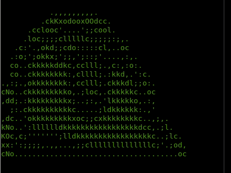
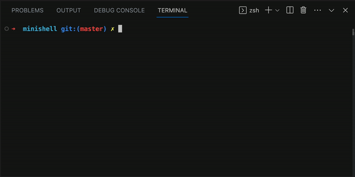

  <h3 align="center">Minishell</h3>
  Build Your Own Unix Shell (Terminal)
   
   

 

# Minishell

Crafted to replicate the core functions of a Unix shell. We start by handling basic command execution and progress to advanced features like piping and redirection. Built using pure C, this project reinforces key concepts in process management and signal handling.

 

## How to run

- Go to root directory and run `make`
- Run `./minishell`
- You're inside our shell now, enjoy!

 

## Implemented:
* Prompt display
* Command history (up and down arrows)
* System executables available from the environment (`ls`, `cat`, `grep`, etc.)
* Builtin commands:
  * `echo`: Allow option `-n`
  * `cd`: Relative or absolute path
  * `pwd`: No args
  * `export`: Export variables in bash
  * `unset`: No args
  * `env`: No options. No args
  * `exit`: Allow exit number

* Pipes: `|` which redirect output from one command to input for the next

* Re-directions:
  * `>` redirects output
  * `>>` redirects output in append mode
  * `<` redirects input
  * `<< DELIMITER` displays a new prompt. HereDoc
  	`DELIMITER` redirects user input to command input

  * `$?` expands to the exit status of the most recently executed foreground pipeline.

* Signals:
  * `ctrl-c`: displays a new prompt line. SIGINT: SIGINT resets the user input
  prompt to a new blank line.
  * `ctrl-d`: exit.
  * `ctrl-\`: does nothing.

* Lexer: It helps you to convert a sequence of characters into a sequence of tokens

* Parser: The parser will then check for invalid syntax and create a kind of command

 