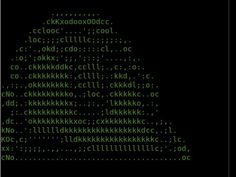
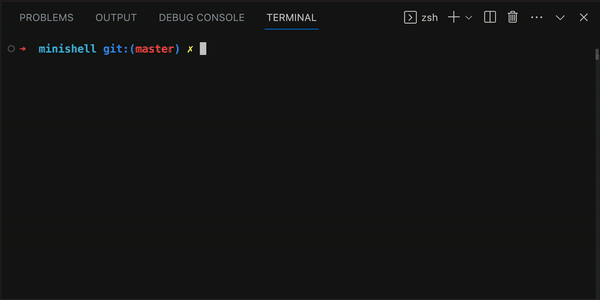

  <h3 align="center">Minishell</h3>
  A small Unix shell, written from scratch in C
   
   

 

# Minishell

A minimal recreation of a Unix shell, built in pure C. The project walks through the full path a typed line takes inside a real shell: reading input, splitting it into tokens, parsing those tokens into commands, and finally executing them with the right plumbing for pipes, redirections, and signals. It is a hands-on exercise in process management, file descriptors, and how the terminal actually talks to your programs.

 

## Getting started

- From the project root, run `make` to build the binary
- Launch it with `./minishell`
- A prompt appears — start typing commands as you would in bash

 

## Features

* Interactive prompt with line editing
* Command history navigated with the up and down arrow keys
* Runs any executable found through the `PATH` environment variable (`ls`, `cat`, `grep`, and so on)
* Builtin commands:
  * `echo` with the `-n` flag
  * `cd` accepting relative or absolute paths
  * `pwd` with no arguments
  * `export` to add or update environment variables
  * `unset` to remove environment variables
  * `env` to print the current environment
  * `exit` with an optional exit code

* Pipes: `|` connects the output of one command to the input of the next

* Redirections:
  * `>` writes output to a file, replacing it
  * `>>` writes output to a file, appending to it
  * `<` reads input from a file
  * `<< DELIMITER` opens a here-document — input is read line by line until `DELIMITER` is entered, then fed to the command

  * `$?` expands to the exit status of the most recent foreground pipeline

* Signal handling:
  * `ctrl-c` cancels the current input and shows a fresh prompt (SIGINT)
  * `ctrl-d` on an empty line exits the shell
  * `ctrl-\` is ignored, matching bash behaviour

* Lexer: turns the raw input string into a stream of tokens, handling quoting and variable expansion along the way

* Parser: validates the token stream, reports syntax errors, and assembles the structured command tree the executor runs

 
